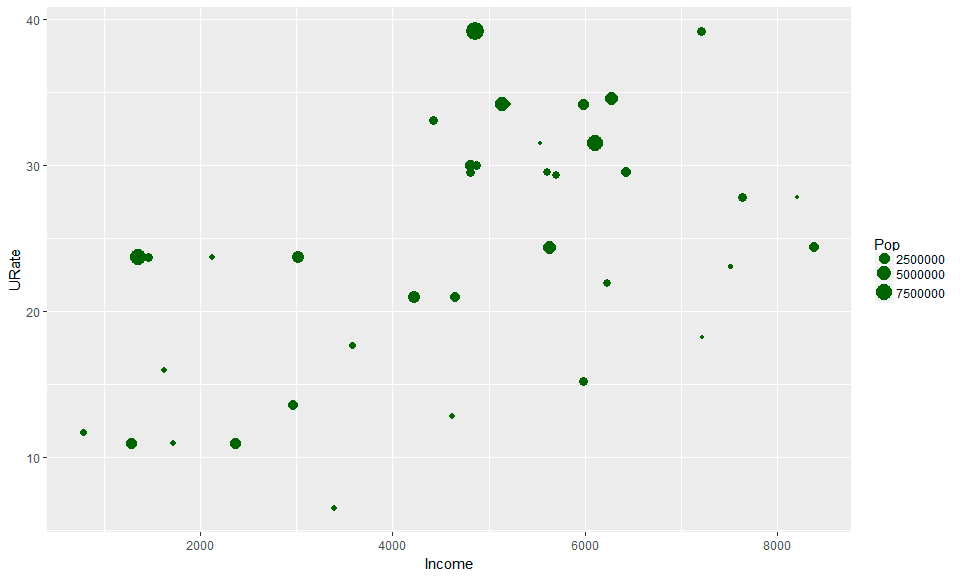

# exploracion
Análisis Exploratorio Inicial
<table style="width: 100%;" border="0" cellpadding="5">
<tbody>
<tr>
<td style="text-align: center; border-radius: 5px;" colspan="2" bgcolor="#3366CC" width="80%">EXPLORACIÓN DE DATOS </td>
</tr>
<tr onmouseover="this.style.backgroundColor = '#F5F5F5'" onmouseout="this.style.backgroundColor = '#fff'" style="background-color: #ffffff;">
<td style="text-align: center; width: 20%;" valign="top"></td>
<td style="text-align: center; width: 80%;" valign="top">

Right to Work Law

Right to Work Law es un conjunto de normas implementadas en los Estados Unidos durante la Administración Obama que buscaba proteger al trabajador al impedir la tercerización laboral y exigir la vinculación directa del empleado.

La base de datos proviene de un ejercicio realizado por la Universidad de California en Los Ángeles (UCLA) y contiene algunas de las variables más relevantes para el análisis del impacto de dicha política.

El ejercicio consiste en un análisis exploratorio de lo datos que busca identificar patrones y/o parámetros que faciliten la posterior modelización. Por los alcances del curso en este punto el análisis se basará en las posibles relaciones entre las variables Tasa de Desempleo (URate) e Ingreso (Income)

Recuerde la discusión hecha en clase

</td>
</tr>
</tbody>
</table>

<h2 style="text-align: left;">Importación de Datos</h2>

Para empezar, vamos a tomar la información del archivo <strong>RightToWorkLaw.txt</strong> almacenado en la plataforma <a href="https://github.com/karlosmantilla/importacion" title="Enlace a GitHub" target="_blank">GitHub</a> y en <a href="https://www.dropbox.com/s/i0pnh74xmtnaopx/RightToWorkLaw.txt?dl=0" title="Enlace a Dropbox" target="_blank">dropbox</a>. Descargado el archivo se procede a importarlo. Para este caso, se va a utilizar la acción básica de copiar y pegar; para ello se abre el archivo con el bloc de notas, se copia el contenido y se ejecuta el siguiente comando:

<pre><code class="r">&gt; datos.cp &lt;- read.delim("clipboard")
</code></pre>

Con lo anterior se han copiado los datos al programa. Para observar si la importación fue correcta se puede emplear:

<pre><code class="r">&gt; head(datos.cp)
            COL   PD URate     Pop Taxes Income RTWL
Atlanta     169  414  13.6 1790128  5128   2961    1
Austin      143  239  11.0  396891  4303   1711    1
Bakersfield 339   43  23.7  349874  4166   2122    0
Baltimore   173  951  21.0 2147850  5001   4654    0
Baton Rouge  99  255  16.0  411725  3965   1620    1
Boston      363 1257  24.4 3914071  4928   5634    0
</code></pre>

Inicialmente, se puede observar el tipo de variable y algunos resúmenes numéricos básicos:

<pre><code class="r">&gt; sapply(datos.cp, class)
      COL        PD     URate       Pop     Taxes    Income      RTWL 
"integer" "integer" "numeric" "integer" "integer" "integer" "integer" 
&gt; summary(datos.cp)
          City         COL              PD             URate            Pop              Taxes          Income          RTWL       
 Atlanta    : 1   Min.   : 99.0   Min.   :  43.0   Min.   : 6.50   Min.   : 162304   Min.   :3965   Min.   : 782   Min.   :0.0000  
 Austin     : 1   1st Qu.:170.8   1st Qu.: 302.0   1st Qu.:17.82   1st Qu.: 497050   1st Qu.:4620   1st Qu.:3110   1st Qu.:0.0000  
 Bakersfield: 1   Median :205.5   Median : 400.0   Median :24.05   Median :1408054   Median :4858   Median :4865   Median :0.0000  
 Baltimore  : 1   Mean   :223.6   Mean   : 780.2   Mean   :24.22   Mean   :2040736   Mean   :4903   Mean   :4709   Mean   :0.2632  
 Baton Rouge: 1   3rd Qu.:266.5   3rd Qu.: 963.8   3rd Qu.:30.00   3rd Qu.:2355462   3rd Qu.:5166   3rd Qu.:6082   3rd Qu.:0.7500  
 Boston     : 1   Max.   :381.0   Max.   :6908.0   Max.   :39.20   Max.   :9561089   Max.   :6404   Max.   :8392   Max.   :1.0000  
 (Other)    :32                                                                                                                    
</code></pre>

Ahora, aprovechando que se trata de datos de corte transversal, se puede asignar el nombre de cada a ciudad a la fila correspondiente usando el comando row.names() e indicando que la columna City es la que se va a emplear. Como dicha columna es la primera del conjunto de datos se emplea la discriminación datos.cp[,1] para esto:

<pre><code class="r">&gt; row.names(datos.cp)&lt;-datos.cp[,1]
&gt; datos.cp&lt;-datos.cp[,-1]
&gt; head(datos.cp)
            COL   PD URate     Pop Taxes Income RTWL
Atlanta     169  414  13.6 1790128  5128   2961    1
Austin      143  239  11.0  396891  4303   1711    1
Bakersfield 339   43  23.7  349874  4166   2122    0
Baltimore   173  951  21.0 2147850  5001   4654    0
Baton Rouge  99  255  16.0  411725  3965   1620    1
Boston      363 1257  24.4 3914071  4928   5634    0
</code></pre>

Ahora, se procede a construir la matriz de correlaciones:

<pre><code class="r">&gt; cor.mat &lt;- round(cor(datos.cp),2) &gt; cor.mat
         COL    PD URate   Pop Taxes Income  RTWL
COL     1.00  0.39  0.27  0.43  0.37   0.29 -0.47
PD      0.39  1.00  0.42  0.83  0.34   0.07 -0.28
URate   0.27  0.42  1.00  0.37  0.09   0.53 -0.79
Pop     0.43  0.83  0.37  1.00  0.50  -0.04 -0.30
Taxes   0.37  0.34  0.09  0.50  1.00   0.06 -0.29
Income  0.29  0.07  0.53 -0.04  0.06   1.00 -0.51
RTWL   -0.47 -0.28 -0.79 -0.30 -0.29  -0.51  1.00
<!-----></code></pre>

Para el análisis exploratorio, es aconsejable realizar primero un análisis gráfico. Para obtener gráficas de más calidad y un poco más completas se pueden emplear algunas librerías. Como es probable que éstas no se encuentren instaladas, se procede a su instalación mediante las siguientes líneas:

<pre><code class="r">&gt; install.packages('ggplot2')
&gt; install.packages('reshape2')
&gt; install.packages('GGally')
&gt; install.packages('ggrepel')
</code></pre>

Con las líneas anteriores se selecciona el CRAN (Comprehensive R Archive Network); aquí usted selecciona en la opción (HTTP mirror) de la primera ventana emergente y en la segunda emergente usted selecciona el servidor de preferencia.

Instalados los paquetes proceda a llamar las librerías:

<pre><code class="r">&gt; library(ggplot2)
&gt; library(reshape2)
&gt; library(GGally)
&gt; library(ggrepel)
</code></pre>

En primera instancia se va a construir con la matriz de correlaciones un <strong>data.frame</strong> (ordenamiento de datos) para lo que se emplea lo siguiente

<pre><code class="r">&gt; melted_cormat&lt;-melt(cor.mat)
&gt; head(melted_cormat)
    Var1 Var2 value
1    COL  COL  1.00
2     PD  COL  0.39
3  URate  COL  0.27
4    Pop  COL  0.43
5  Taxes  COL  0.37
6 Income  COL  0.29
</code></pre>

Ahora es posible graficar la matriz de correlaciones usando la siguiente linea de comandos:

<pre><code class="r">&gt; ggplot(data = melted_cormat, aes(x=Var1, y=Var2, fill=value)) + geom_tile()
</code></pre>

Se observa en el lado derecho de la gráfica la nomenclatura para interpretar los valores del gráfico. Existe otra gráfica más simple para su interpretación y se construye como se indica a continuación:

<pre><code class="r">&gt; ggcorr(datos.cp, palette = "RdBu", label = TRUE)
</code></pre>

Con la información suministrada en este gráfico se puede considerar las posibles configuraciones del modelo a construir. Así que se procede a construir un diagrama de dispersión para las variables de interés en este ejercicio; para ello se emplea la siguiente línea de comandos (recuerde la explicación sobre los argumentos dada en clase):

<pre><code class="r">&gt; win.graph(10,6,6) # Sirve para determinar las dimensiones de la imagen: 10 pts de ancho, 6 pts de alto y Tamaño de Fuente 6
&gt; ggplot(datos.cp, aes(x=Income, y=URate)) + geom_point(size=3, col="darkgreen")
</code></pre>

Es posible incluir más variables que permitan intuir el comportamiento del modelo; para el ejemplo se va a incluir el tamaño poblacional para analizar las posibles influencias de esta variable:

<pre><code class="r">&gt; ggplot(datos.cp, aes(x=Income, y=URate)) +  geom_point(aes(size=Pop),col="darkgreen")
</code></pre>

Son muchas las opciones gráficas que hay. Por ejemplo, es posible incluir el nombre de las ciudades para identificar las observaciones en el diagrama de dispersión:

<pre><code class="r">&gt; ggplot(datos.cp, aes(x=Income, y=URate)) +  geom_point(aes(size=Pop),col="darkgreen")+ geom_text_repel(label=rownames(datos.cp))
</code></pre>

O se puede añadir un gráfico de densidad bidimensional para identificar los posibles centros de atracción de los datos:

<pre><code class="r">&gt; ggplot(datos.cp, aes(x=Income, y=URate)) +  geom_point(aes(size=Pop),col="darkgreen")+ geom_text_repel(label=rownames(datos.cp)) + geom_density_2d()
</code></pre>

O incluir la recta de regresión y el intervalo de confianza para tener una aproximación del posible modelo:

<pre><code class="r">&gt; ggplot(datos.cp, aes(x=Income, y=URate)) +  geom_point(aes(size=Pop),col="darkgreen")+ geom_text_repel(label=rownames(datos.cp)) +  geom_smooth(method=lm)
</code></pre>

También es posible graficar otro tipo de regresión y combinar con más elementos:

<pre><code class="r">&gt; ggplot(datos.cp, aes(x=Income, y=URate)) +  geom_point(aes(size=Pop),col="darkgreen")+ geom_text_repel(label=rownames(datos.cp)) +  geom_smooth()+ geom_density_2d()
</code></pre>

O se puede incluir el efecto de implementación o no del estatuto RTWL

<pre><code class="r">&gt; ggplot(datos.cp,aes(x=Income, y=URate, color=as.factor(RTWL))) + geom_point(aes(size=Pop))+ scale_color_manual(values = c('#999999','#E69F00')) + theme(legend.position=c(0,1), legend.justification=c(0,1))+ geom_smooth(method=lm)+ geom_density_2d()
</code></pre>

Finalmente, es posible incluir otros gráficos como diagramas de caja:

<pre><code class="r">&gt; ggplot(datos.cp,aes(y = URate, x = factor(RTWL)))  + geom_boxplot()+ labs(x="Application RTWL",y="Unemployed Rate")+  stat_summary(fun.y=mean, colour="red", geom="point", shape=20, size=3,show_guide = FALSE)
</code></pre>

Recuerde que una adecuada exploración gráfica ayuda a evitar construir modelos innecesarios

